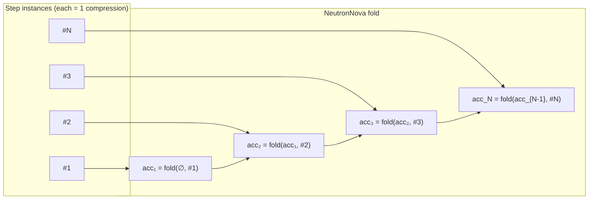
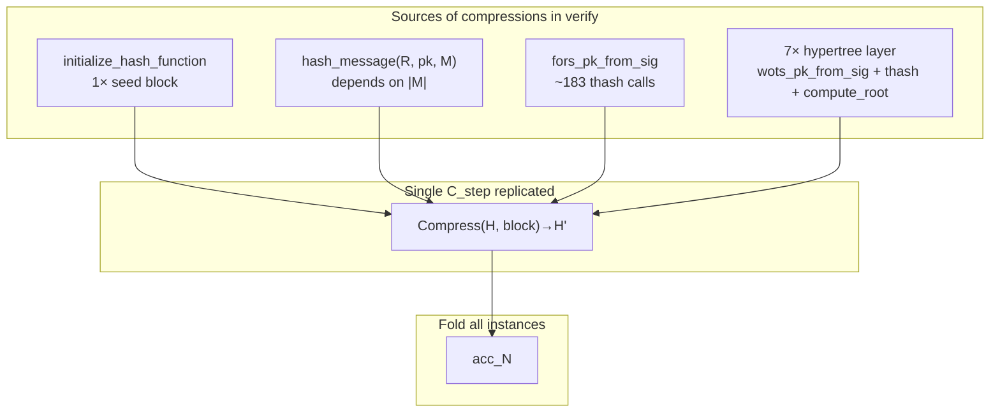
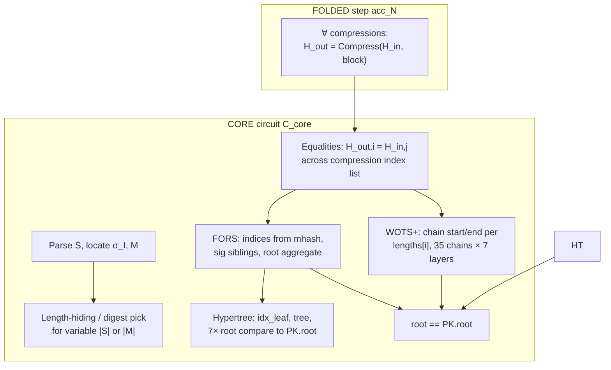
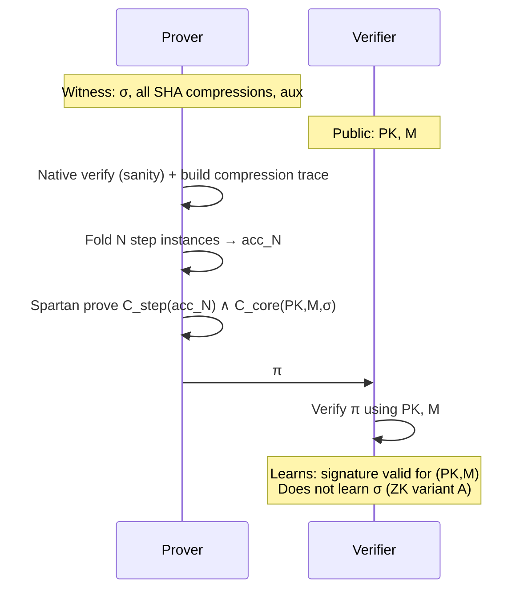
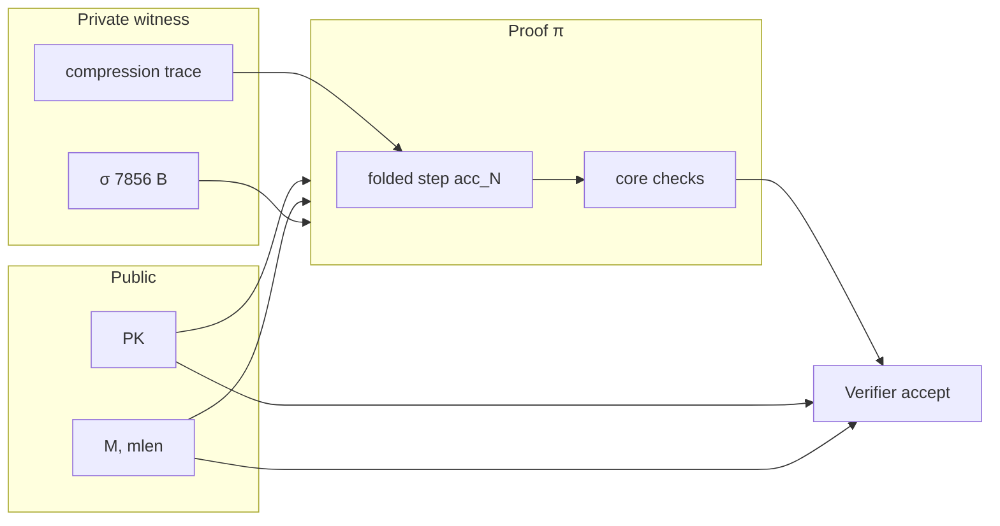

# Folding, step vs core circuits, and hash call sites

This document clarifies **what one “step” is**, how **NeutronNova folding** applies across many SHA-256 compressions during **SPHINCS+ signature verification**, and what lives in the **core** circuit. Hash call sites are derived from PQClean `sphincs-sha2-128s-simple` (`clean/`), matching `crypto_sign_verify` in `sign.c`.

**Scope:** signature verification only (no credentials). See [PLAN.md](PLAN.md).

**Parameter constants (128s simple):**

| Symbol | Value |
|--------|------:|
| `SPX_N` | 16 |
| `SPX_FORS_HEIGHT` | 12 |
| `SPX_FORS_TREES` | 14 |
| `SPX_WOTS_LEN` | 35 |
| `SPX_WOTS_W` | 16 |
| `SPX_TREE_HEIGHT` | 9 (`63 / 7`) |
| `SPX_D` (hypertree layers) | 7 |
| `SPX_SHA256_ADDR_BYTES` | 22 |
| `thash` input bytes | `22 + inblocks × 16` |

---

## 1. One step = one SHA-256 **compression**

| Term | Meaning |
|------|---------|
| **Logical hash** | Spec/API call: `thash(...)`, `hash_message(...)`, `sha256(...)` |
| **Compression** | One application of SHA-256 block function: `f(H, 64-byte block) → H'` |
| **Step circuit** | R1CS for **one compression** (same shape every time) |
| **Step instance** | One witness `(H_in, block, H_out)` satisfying the step circuit |

A single `thash` with a 582-byte finalize buffer uses **multiple compressions** → **multiple step instances**, all foldable into one accumulator.

```text
thash(…)  ──►  clone(state_seeded)  ──►  sha256_inc_finalize(buf)
                    │                         │
                    │                         ├─ compression
                    │                         ├─ compression
                    │                         └─ …
```

**Not** one step per `thash` unless you build a separate fixed-size “full hash” gadget (see §5).

---

## 2. SplitNeutronNova folding (detailed)

Folding merges **many satisfactions of the same step circuit** into **one accumulated instance**. The core circuit then asserts that the folded accumulator is consistent with SPHINCS+ wiring (chain ends, roots, indices).

### 2.1 Pairwise fold chain



### 2.2 Where instances come from (one verify)



**Across many hash invocations?** **Yes.** Credential hashing, `hash_message`, every `thash`, and every `mgf1`/`sha256` block inside verify all decompose into the **same** `C_step`. One fold pipeline, one `acc_N`.

### 2.3 What the core checks (glue)

The core does **not** re-implement bulk SHA. It wires endpoints:



---

## 3. ZK proof protocol (signature only)





---

## 4. Hash call sites in `crypto_sign_verify`

Source: `third_party/PQClean/crypto_sign/sphincs-sha2-128s-simple/clean/`.

### 4.1 Summary table

| # | Call site | Function | Input length | Fixed? | Logical calls per verify | Notes |
|---|-----------|----------|--------------|--------|--------------------------|-------|
| 1 | Context init | `seed_state` → `sha256_inc_blocks` | 64-byte block (`pub_seed` padded) | **Yes** | 1 block absorb | Precomputes `state_seeded` for all `thash` |
| 2 | Message digest | `hash_message` | `48 + \|M\|` bytes (R‖pk‖M) | **No** (`\|M\|`) | 1× incremental finalize + **mgf1** | See §4.2 |
| 3 | MGF1 expand | `mgf1_256` inside `hash_message` | `inlen = 48`, `outlen = 30` | **Yes** | 1× `sha256` | `SPX_DGST_BYTES = 30` |
| 4 | FORS leaf | `fors_sk_to_leaf` → `thash(..., 1)` | 38 B | **Yes** | 14× | One per FORS tree |
| 5 | FORS path | `compute_root` → `thash(..., 2)` | 54 B | **Yes** | 14 × 12 = **168** | `tree_height - 1` + final per tree |
| 6 | FORS root | `thash(..., 14)` | 246 B | **Yes** | 1× | Horizontal root hash |
| 7 | WOTS chain | `gen_chain` → `thash(..., 1)` | 38 B | **Per-chain steps** | **Σᵢ (15 − lengths[i])** per layer | `lengths` from 16-byte `root`; avg ≈ 7×35 per layer |
| 8 | WOTS leaf | `thash(wots_pk, SPX_WOTS_LEN)` | 582 B | **Yes** | 7× | Once per hypertree layer |
| 9 | XMSS path | `compute_root` (HT) → `thash(..., 2)` | 54 B | **Yes** | 7 × 9 = **63** | `SPX_TREE_HEIGHT = 9` per layer |

**Not in verify path:** `prf_addr`, `gen_message_random` (signing only).

### 4.2 `hash_message` and variable `M`

Signed message `M` is the prover’s input message (bounded by `M_MAX`). PQClean:

```c
// hash_sha2.c — prefix fixed, tail variable
memcpy(inbuf, R, SPX_N);
memcpy(inbuf + SPX_N, pk, SPX_PK_BYTES);  // 32 bytes
// then M: mlen bytes (variable)
shaX_inc_finalize(...) or inc_blocks + finalize
mgf1_256(buf, SPX_DGST_BYTES, seed, (2 * SPX_N) + 32);
```

| Subcase | Condition | Behavior |
|---------|-----------|----------|
| Short `M` | `48 + mlen < 64` | Single finalize over prefix‖M |
| Long `M` | else | One full `inc_blocks` on 64 B prefix, then finalize on rest of M |

**ZK implication:** compression count grows with `|M|` in **fixed steps** (per 64-byte block). Hiding `|M|` still needs **length-hiding digest selection** (Vega lookup) or **pad-to-max** in the core.

### 4.3 `thash` compression count (per call)

`thash` clones `state_seeded` (already absorbed one 64-byte block), then finalizes `buf` of length `22 + 16×inblocks`:

| `inblocks` | `buf` len | Typical extra compressions (finalize) |
|------------|----------|---------------------------------------|
| 1 | 38 | 1 |
| 2 | 54 | 1 |
| 14 | 246 | 4 |
| 35 | 582 | 10 |

Exact counts should be confirmed with instrumentation (`scripts/count-sha-compressions.sh` — planned).

### 4.4 Order-of-magnitude compression budget (verify only)

| Component | thash calls (fixed part) | Compressions (rough) |
|-----------|--------------------------|----------------------|
| Init + mgf1 | — | ~2–5 |
| `hash_message` | — | **2 + ⌈mlen/64⌉** (variable) |
| FORS | 183 | ~183 × 1–4 ≈ **200–400** |
| WOTS (7 layers) | 63 + 7 + 35×avg_steps | **~1,500–2,500** (avg steps ≈ 7) |
| **Total** | | **~2,000–3,000+** |

**Measured (M0, `cargo run -p sphincs-ref --bin sphincs-trace-stats`):** ~2236 compressions for a 33-byte message verify; count varies with message-dependent WOTS paths.

Proving cost scales with compression count, not mainly with 8 KB signature size.

---

## 5. Full-hash step vs compression step vs length lookup

| Strategy | When it helps | Length lookup for variable `S` / `M`? |
|----------|---------------|----------------------------------------|
| **Compression step + fold all** | Default; one `C_step` for full verify | **Still yes** if `mlen` must stay private (v2) |
| **Fixed full-hash gadget in core** | `thash` with fixed `inblocks` (1, 2, 14, 35) | No lookup **inside** that gadget |
| **Pad `M` to `M_MAX`** | **v1** ([DECISIONS.md](DECISIONS.md)) | No lookup; public `mlen` |

**SPHINCS+ internals** use fixed-size `thash` buffers; only `hash_message` grows with `|M|` in steps of 64 bytes.

---

## 6. Variable message length

Only `hash_message` depends on `|M|`. For public `M` with bound `M_max`:

- Pad `M` to `M_max`, public `mlen`
- Core enforces inactive suffix bytes are zero (or ignored)
- Extra compressions fold like all others

Private `mlen` or private `M` → add digest lookup (v2 in [PLAN.md](PLAN.md)); not required for v1.

---

## 7. Implementation checklist

- [ ] Instrument PQClean verify: log every `sha256_inc_*` compression (`scripts/count-sha-compressions.sh`)
- [ ] Assign global compression indices; core encodes `H_out[i] → H_in[j]` equalities
- [ ] Circom `sha256_compress` step gadget + `prepare_core` glue
- [ ] Variable `M`: implement digest lookup or `M_max` padding policy
- [ ] Spartan2: prove + ZK mode; commit to hidden σ

---

## 8. Related docs

- [DESIGN.md](DESIGN.md) — proof system and commitment choices
- [CIRCUIT.md](CIRCUIT.md) — submodule list
- [PARAMETERS.md](PARAMETERS.md) — byte sizes
- PQClean path: `third_party/PQClean/crypto_sign/sphincs-sha2-128s-simple/clean/sign.c`
