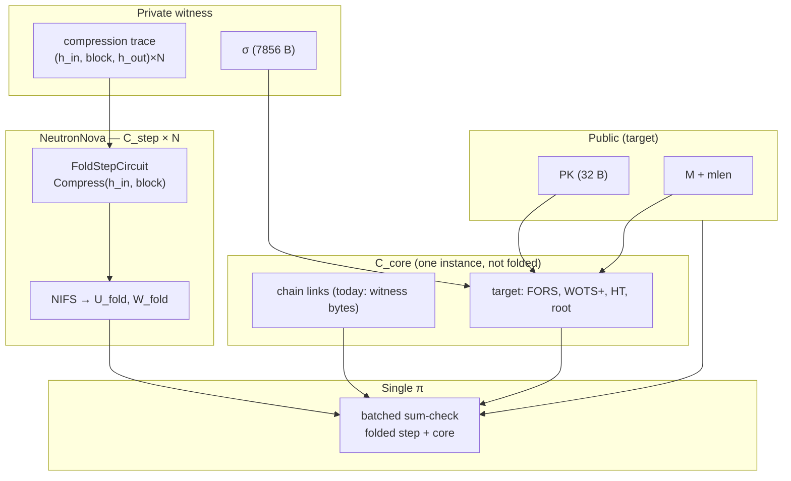
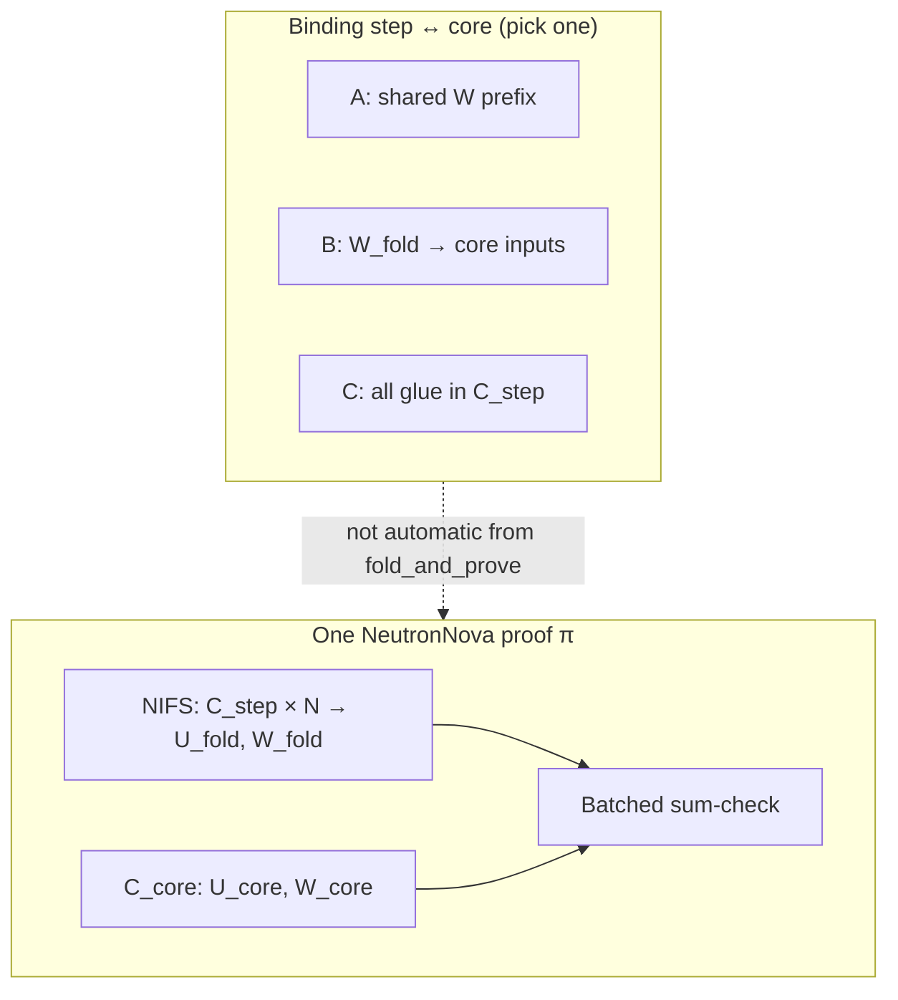
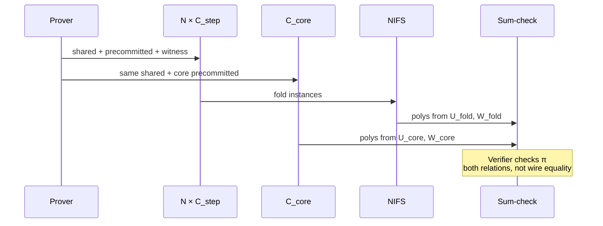

# SPHINCS+ Spartan2 — ZK verify plan & open problems

> **Repo:** [github.com/miha-stopar/sphincs-circuit](https://github.com/miha-stopar/sphincs-circuit) · branch [`master`](https://github.com/miha-stopar/sphincs-circuit/tree/master)  
> **This note (source):** [`docs/HACKMD_NEUTRONNOVA_PLAN.md`](https://github.com/miha-stopar/sphincs-circuit/blob/master/docs/HACKMD_NEUTRONNOVA_PLAN.md)

---

## 1. Goal

Prove in zero-knowledge that a **SPHINCS+-SHA2-128s-simple** signature is valid for a message under a public key—without revealing the signature (ZK variant **A**: public `PK`, `M`, `mlen`; private `σ` and auxiliary hash trace).

| | Reference | Public inputs | Private witness |
| --- | --- | --- | --- |
| Native verify | PQClean `crypto_sign_verify` | `PK`, `M`, `σ` | — |
| This work (target) | Same relation in R1CS | `PK`, `M`, `mlen` | `σ`, every SHA-256 compression in verify, FORS/WOTS/HT aux |

**Track A proof stack (v1):** transparent SNARK **Spartan2 0.9.0** + **NeutronNova** folding over a uniform **step** circuit (one SHA-256 compression per instance) plus a separate **core** circuit (SPHINCS+ structure and digest linking). PCS: **Hyrax** (`T256HyraxEngine`). Folding and PCS are classical, not lattice-based; the **signature scheme** is post-quantum (SPHINCS+).

**Why folding:** one verify touches on the order of **~2k–3k** SHA-256 compressions. Replicating a full hash gadget per compression in a single R1CS is impractical; NeutronNova folds many satisfactions of the same `C_step` before a final Spartan proof that also includes `C_core`.

---

## 2. Architecture (current)



### Crate split

| Crate | Role |
| --- | --- |
| `sphincs-ref` | PQClean FFI, `verify_with_trace`, compression trace |
| `sphincs-circuit` | R1CS gadgets: `sha256_compress`, `thash`, FORS, WOTS, hypertree, `synthesize_verify_core` |
| `sphincs-prover` | `FoldStepCircuit`, `FoldCoreChainCircuit`, NeutronNova `setup` / `fold_and_prove` / `verify` |

Parameter set: **SPHINCS+-SHA2-128s-simple** (PQClean `sphincs-sha2-128s-simple`).

---

## 3. Two circuits, one proof — what “combined” means

SPHINCS+ verify in this repo is split into two **different** R1CS circuits on purpose:

| Circuit | Role | Folded? |
| --- | --- | --- |
| **`C_step`** (`FoldStepCircuit`) | One SHA-256 compression: `(h_in, block) → h_out` | Yes — `N` instances are merged by NeutronNova (NIFS) into one accumulated instance `(U_fold, W_fold)` |
| **`C_core`** (`FoldCoreChainCircuit`, later full verify glue) | Everything that is *not* a raw compression: chain topology, FORS, WOTS+, hypertree, `root == PK.root`, … | No — a **single** instance `(U_core, W_core)` |

They are **not** one big bellpepper gadget. Step and core have different constraint matrices (`S_step` vs `S_core`). You still get **one** proof π at the end because Spartan2 runs a **batched sum-check** that simultaneously shows:

- the **folded step** relation is satisfiable, and  
- the **core** relation is satisfiable.

Think of it like proving “document A is valid” and “document B is valid” in one zk bundle: the verifier checks both, but text in A is not automatically the same variables as text in B unless you **explicitly equate** them.

### What we still need: binding (same digest, same variable)

For a sound SPHINCS+ proof we need constraints of the form:

```text
∀i:  h_out,i = Compress(h_in,i, block_i)              ← C_step (many instances, then fold)
∀ link:  h_out,i = h_in,j   using the SAME assignment  ← must match C_step outputs, not a second copy
```

The hard part is the second line **across** circuits. Today’s smoke path (`fold_local_chain`) puts `h_out[i] == h_in[i+1]` in **`C_core` only**, by allocating **fresh** 32-byte witnesses from the PQClean trace. The compressions in **`C_step`** use **different** wires. An honest prover fills both from the trace; a **malicious** prover could pick digest A in the step circuit and digest B in the core circuit and still pass π if each relation is satisfiable on its own.

**Binding** means: choose a design where “link digest between step *i* and *i*+1” is **one** witness slot that both `C_step` and `C_core` constraints read — not two copies that the prover could mismatch.

### Three ways to bind step outputs to core (candidate solutions)

These are the main engineering options; only the third is fully working on Spartan2 0.9.0 today.

#### Option A — Shared witness (Spartan2 `SpartanCircuit::shared`)

**Idea:** Allocate link digests once in the **shared** segment of the witness vector `W` (indices `0 .. num_shared-1`). Every step instance and the core circuit use the **same** `comm_W_shared` and the same field values in that prefix.

- In **`C_step` `precommitted`:** after `Compress(...)`, constrain compression output words to equal `shared[k]` (outgoing link) and/or incoming `h_in` to `shared[k-1]`.
- In **`C_core` `precommitted`:** constrain `shared[k]` to equal trace topology bytes (or to FORS/WOTS inputs derived from them).

**Pros:** Keeps the intended NeutronNova split (bulk SHA in fold, glue in core).  
**Status (2025-06):** **Fixed** — uniform one-hot selector in `FoldStepBoundCircuit` keeps identical R1CS shape across folded instances. `fold_bound_shared` passes. See [SHARED_WITNESS_DEBUG.md](SHARED_WITNESS_DEBUG.md).

#### Option B — Fold accumulator as core inputs (“fold IO”)

**Idea:** NeutronNova folding does not throw away step witnesses — it produces an accumulated instance **`(U_fold, W_fold)`** whose witness encodes (in a folded form) all step instances. **Fold IO** means: expose selected entries of `W_fold` (or challenges derived from the fold) as **public or private inputs** to `C_core`, and write core constraints that refer to those values — e.g. “core link *k* equals folded witness word *w*”.

**Pros:** Core stays separate; binding is explicit in the proof algebra.  
**Cons:** Not implemented in our crate; unclear how much of `W_fold` is addressable from `SpartanCircuit::synthesize` in Spartan2 0.9.0 (needs API audit — open problem P3).

**Intuition:** Shared witness ties circuits **before** fold via one committed prefix; fold IO ties core **after** fold to the accumulated step blob. Both aim at the same goal: core must not use independent copies of digests.

#### Option C — Put glue inside one `C_step` (packed chain)

**Idea:** Avoid cross-circuit binding entirely for local chains: implement several compressions **in one** step instance with **wire** `h_out[i] → h_in[i+1]`, plus optional boundary checks against trace bytes in the **same** `ConstraintSystem` (`FoldPackedChainCircuit`, `FoldPackedCoreBoundCircuit`).

**Pros:** **Sound** for that segment today; NeutronNova verify passes.  
**Cons:** The separate **`C_core`** is only a **placeholder** (dummy SHA block for shape padding, like Spartan’s benchmark). Real SPHINCS+ glue (FORS, hypertree, …) still has to land somewhere — either move into a future fat core with Option A/B, or repeat packed segments.

| Option | Step + core split? | Binds step wires to glue? | Works on Spartan2 0.9.0? |
| --- | --- | --- | --- |
| **A** Shared witness | Yes | Yes | **Yes** (uniform selector) |
| **B** Fold IO → core | Yes | Yes (if API allows) | Not tried |
| **C** Packed in `C_step` | No (core dummy) | Yes (in one circuit) | **Yes** (local chain) |



**Demo — split circuits without binding (Option none):**

```bash
cargo test -p sphincs-prover --features pqclean \
  --test fold_split_step_core -- --nocapture
```

---

## 4. Spartan2 prove pipeline

Two shapes: `S_step`, `S_core`, then `SplitR1CSShape::equalize` (same **total** witness length and row count; segment boundaries may differ — see [SHARED_WITNESS_DEBUG.md](SHARED_WITNESS_DEBUG.md)).

| Phase | What runs |
| --- | --- |
| Setup | `r1cs_shape(step)`, `r1cs_shape(core)`, equalize, commitment key |
| prep_prove | `shared_witness(step[0])` → `comm_W_shared`; precommitted per step `i`; precommitted(core) on **same** `shared[]` handles |
| prove | `(U_i, W_i)` for all steps ∥ `(U_core, W_core)` |
| NIFS | fold **steps only** → `(U_fold, W_fold)` |
| Sum-check | batched over folded step + core polynomials → π |



Wrapper: `crates/sphincs-prover/src/fold.rs` → `spartan2::neutronnova_zk::NeutronNovaZkSNARK`.

## 5. What exists in the repo today

### M2 — Core gadgets (mostly done)

Bit-accurate SHA-256 compression step, `thash`, `compute_root`, WOTS+, FORS, hypertree layer, `hash_message`, top-level `synthesize_verify_core` (oracle-aligned tests; full core synthesis test is slow / `#[ignore]` in debug).

### M3 — Folding + prove (in progress)

| Piece | Status |
| --- | --- |
| NeutronNova pipeline on real PQClean trace rows | ✅ |
| `FoldCoreChainCircuit` + `fold_local_chain` | ✅ (byte links in core only) |
| `FoldPackedChainCircuit` / `FoldPackedCoreBoundCircuit` | ✅ sound **intra-step** chain |
| `FoldStepBoundCircuit` + shared witness | ✅ `fold_bound_shared` passes |
| `FoldVerifyCoreCircuit` (`hash_message` increment) | ✅ `fold_verify_core_hash_message` |
| `FoldVerifyCoreCircuit` (`Full` = `synthesize_verify_core`) | ✅ `fold_verify_core_full_setup` (release `--ignored`); see [VERIFY_CORE.md](VERIFY_CORE.md) |
| Full trace / KAT prove | ⬜ |
| `fold-bench` scaling | ✅ |

### Known bugs and unsound paths (do not confuse with “done”)

| Issue | Symptom / risk | Where |
| --- | --- | --- |
| **Split core without binding** | `FoldCoreChainCircuit` checks trace **bytes**; `FoldStepCircuit` checks compressions on **other** wires. Malicious prover can mismatch digests and still verify π. | `fold_split_step_core` — smoke only |
| **Shared witness (resolved)** | Was: per-step conditional pins → R1CS shape mismatch → `InvalidSumcheckProof`. Fixed via uniform selector. | [SHARED_WITNESS_DEBUG.md](SHARED_WITNESS_DEBUG.md) |
| **`h_out` pinning on step** | Explicit `h_out = Compress(...)` in fold step breaks NeutronNova verify | `synthesize_compression` vs `synthesize_compression_for_fold` — pinning avoided on purpose |
| **Placeholder core** | `FoldCoreCircuit` is ~1 SHA block for shape equalization only; proves nothing about SPHINCS+ | Used in `fold_packed_chain`, bench |
| **NeutronNova batch size** | Instance count padded to power of two; duplicating the last step can break **bound** chains | `pad_steps_to_power_of_two`, `longest_chain_bound` |
| **Single step instance** | `num_steps = 1` has caused prover panics in past tests | Use ≥ 2 instances (see packed chain test) |
| **Full verify gadget in prover** | `synthesize_verify_core` in `sphincs-circuit`; **`FoldVerifyCoreCircuit`** ports it incrementally | Phase 2b/2c — see [VERIFY_CORE.md](VERIFY_CORE.md) |
| **`intermediate_roots` removed** | ✅ WOTS topology from chained witness `root_bits` (`witness_bytes_from_bits`) | `hypertree.rs`, `wots.rs`, `verify.rs` |

**Honest status of “we have a zk fold” today:** we can prove π for real PQClean compression rows **and** a separate core, but π does **not** yet imply a full sound SPHINCS+ verify unless you use the **packed** path for the chain fragment or fix **Option A/B**.

### Prover artifacts (quick map)

| Type | Path (in repo) |
| --- | --- |
| Step | `crates/sphincs-prover/src/fold.rs` — `FoldStepCircuit` |
| Core placeholder | `FoldCoreCircuit` (shape padding, Spartan bench parity) |
| Core chain glue | `crates/sphincs-prover/src/core.rs` — `FoldCoreChainCircuit` |
| Shared binding (experimental) | `crates/sphincs-prover/src/bound.rs` |
| Packed sound chain | `packed.rs`, `bound.rs` — `FoldPackedCoreBoundCircuit` |

### Tests

| Test | Meaning |
| --- | --- |
| `fold_split_step_core` | **Split** step + core, one π; explains combination without binding |
| `fold_local_chain` | Split + trace link bytes in core |
| `fold_packed_chain` | Wired chain, placeholder core |
| `fold_bound_packed_core` | Wired chain + boundary checks in step |
| `fold_bound_shared` | ✅ shared witness + bound steps |
| `fold_verify_core_hash_message` | 🟡 `hash_message` core increment |

```bash
# Split step + core demo
cargo test -p sphincs-prover --features pqclean \
  --test fold_split_step_core -- --nocapture

# Local chain fold (default 16 steps; override FOLD_CHAIN_STEPS=32)
cargo test -p sphincs-prover --features pqclean \
  --test fold_local_chain

# Bench (release)
cargo run -p sphincs-prover --features pqclean --release \
  --bin fold-bench -- 16
```

---

## 6. Roadmap phases

| Phase | Status | Deliverable |
| --- | --- | --- |
| **0** Infrastructure | ✅ | Trace → `FoldStepCircuit`, NeutronNova setup/prove/verify, `fold-bench` |
| **1** Sound compression topology | ✅ | Shared binding via uniform selector (`fold_bound_shared`) |
| **2** Real `C_core` | 🟡 | `FoldVerifyCoreCircuit`: `hash_message` smoke → full `synthesize_verify_core` |
| **3** Full trace + KAT | ⬜ | ~2k–3k compressions, PQClean KAT ZK verify |
| **4** Hardening | ⬜ | Public IO, perf, optional length-hiding / robust params |

### Phase 1 detail (binding — see §3 Options A/B/C)

| Option | Implementation | Sound chain across instances? |
| --- | --- | --- |
| **C** Packed | `FoldPackedChainCircuit` / `FoldPackedCoreBoundCircuit` | ✅ per packed segment |
| **A** Shared | `FoldStepBoundCircuit` + `FoldCoreBoundCircuit` | ✅ uniform selector |
| **None** Split smoke | `FoldCoreChainCircuit` + plain `FoldStepCircuit` | ❌ duplicate witness bytes |

**Done:** Option A. Scale bound folding to longer trace prefixes; treat split smoke as demo only.

### Phase 2 detail

- Only **compressions** stay in folded `C_step`.
- **Indices, FORS, WOTS+, hypertree, root** live in `C_core`.
- Logical arrow “folded compressions → chain glue” must become **Option A or B** (§3)—not a second copy of digests in core.

**`mlen` / public IO — staged rollout**

| Stage | `mlen` in circuit | `hash_message` | Public Spartan IO |
| --- | --- | --- | --- |
| **2a (now)** — `VerifyCorePhase::HashMessage` smoke | Synthesis-time constant on `FoldVerifyCoreCircuit` (fixed per proof instance) | `hash_message_bits` slices `message[..mlen]` at circuit build time | Dummy `public_values` (placeholder) |
| **2b** — `VerifyCorePhase::Full` | Same fixed `mlen` per instance OK for KATs / benchmarks | Full `synthesize_verify_core` + trace must match that `mlen` — ✅ wired (`fold_verify_core_full_*`, release `--ignored`) | Begin wiring `PK`, padded `M`, `mlen` via `inputize` |
| **2c** — production v1 | **Public** `mlen` scalar (`VerifyPublic`) | Variable-length preimage (mux or incremental SHA) + compression count `2 + ⌈mlen/64⌉` aligned to trace | Verifier checks `(PK, M, mlen)`; padding off-circuit or on public `M` |

Do **not** block Phase 2a/2b on variable public `mlen` — fixed-`mlen` proofs are sufficient for `fold_verify_core_hash_message` and full-core KATs. Variable public `mlen` is required only when the outer Spartan statement must accept different message lengths in **one** universal circuit.

---

## 7. Open problems

Grouped by impact on a production ZK verify proof.

---

### P1 — Shared witness + NeutronNova verify — **resolved (2025-06)**

**Was:** `num_shared > 0` → `InvalidSumcheckProof` when per-step conditional pins produced different R1CS shapes per folded instance.

**Fix:** Uniform one-hot `step_index` selector in `FoldStepBoundCircuit`; `one_hot_select` / `enforce_cond_link_eq_u32` in `shared_link.rs`.

**Done when:** `fold_bound_shared` passes — ✅.

---

### P1b — Real `C_core` in prover (**Phase 2b done; 2c next**)

**Goal:** Port `synthesize_verify_core` into `FoldVerifyCoreCircuit` as NeutronNova `C_core`.

**Done:** Phase 2a (`hash_message`) + Phase 2b (`VerifyCorePhase::Full`) — see [VERIFY_CORE.md](VERIFY_CORE.md).

**Next (2c):** public `PK, M, mlen`; in-circuit `parse(hm_mgf)`; full trace KAT.

---

### P2 — What does batched sum-check actually couple?

**Question:** Besides `comm_W_shared`, is there any constraint tying `W_fold` to `W_core`?

**Tasks**

- [ ] Audit `NeutronNovaNIFS::prove` + relaxed Spartan verifier in Spartan2.
- [ ] Write explicit “coupling contract” for integrators.

---

### P3 — Fold IO / accumulator → core inputs (Option B in §3)

**Question:** After NIFS, can `C_core` constrain its link variables to equal selected words of `W_fold` (the folded step witness), instead of independent trace bytes?

**Tasks**

- [ ] Search Spartan2 for `folded_W` / `folded_U` exposure into `SpartanCircuit::synthesize` or public IO.
- [ ] Prototype: core link constraint references folded index, not `alloc` from trace only.

---

### P4 — `h_out` pinning on `FoldStepCircuit`

Explicit `h_out = Compress(...)` broke verify (same family as P1). Clarify when output pinning is safe with empty shared.

---

### P5 — Instance count, padding, full trace

NeutronNova batch size → power of two; padding duplicates can break bound chains. Plan batching for ~2244 compressions.

---

### P6 — Core circuit size vs Spartan limits

Full `synthesize_verify_core` may exceed per-circuit limits; may need `MultiRoundCircuit` or sliced core.

---

### P7 — Cross-relation soundness statement

Document precisely what π proves **today** (two relations, one proof) vs **target** (bound digests + full verify).

---

## 8. Soundness checklist (integrator view)

| Claim | In π today? | Notes |
| --- | --- | --- |
| Each step row: `Compress(h_in, block)` | ✅ folded `C_step` | `h_out` not pinned to witness (Spartan2 0.9.0) |
| Local chain: `h_out[i] = h_in[i+1]` | ⚠️ | Core bytes only; not step wires |
| `hm`, FORS, WOTS+, HT, root | ⬜ | Gadgets exist; not in prover `C_core` yet |
| Step outputs = core link vars | ❌ | Needs P1 / P3 / packed workaround |
| σ hidden (ZK A) | ✅ | Spartan ZK mode; σ in witness |

---

## 9. References

| Resource | URL |
| --- | --- |
| **This repository** | https://github.com/miha-stopar/sphincs-circuit |
| Spartan2 NeutronNova SHA-256 bench | https://github.com/Microsoft/Spartan2/blob/main/benches/sha256_neutronnova.rs |
| SPHINCS+ spec | https://sphincs.org/ |
| PQClean | https://github.com/PQClean/PQClean |

---

*Last updated: 2026-05-29 — published from [`master`](https://github.com/miha-stopar/sphincs-circuit/tree/master).*
