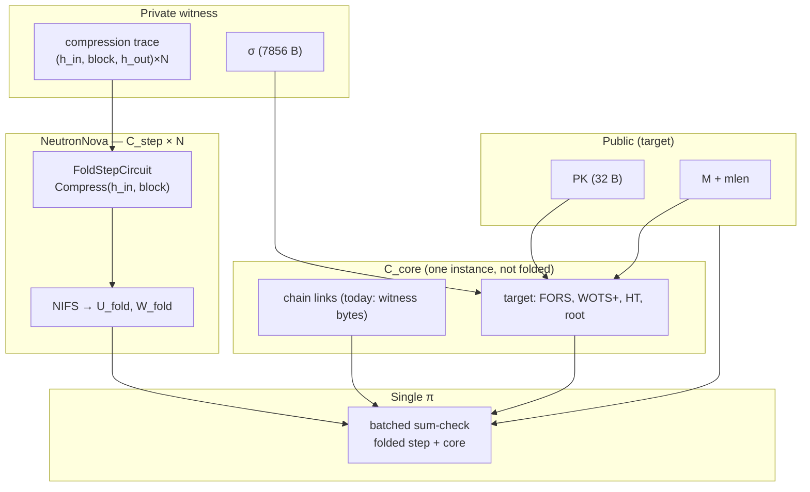
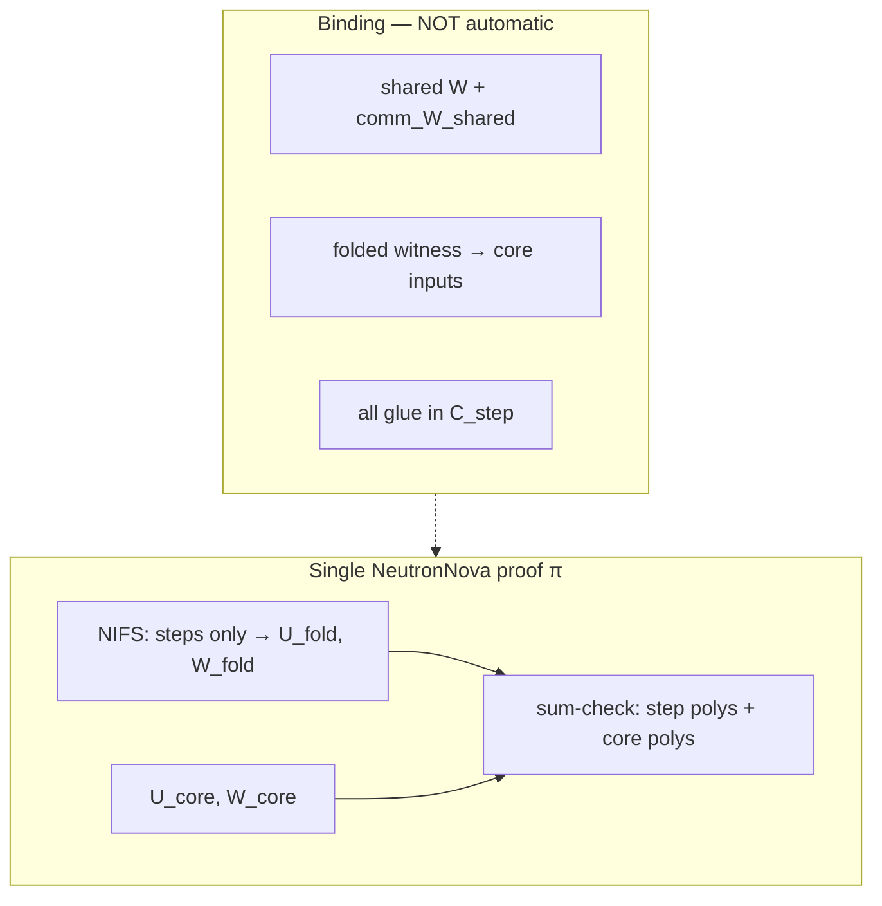
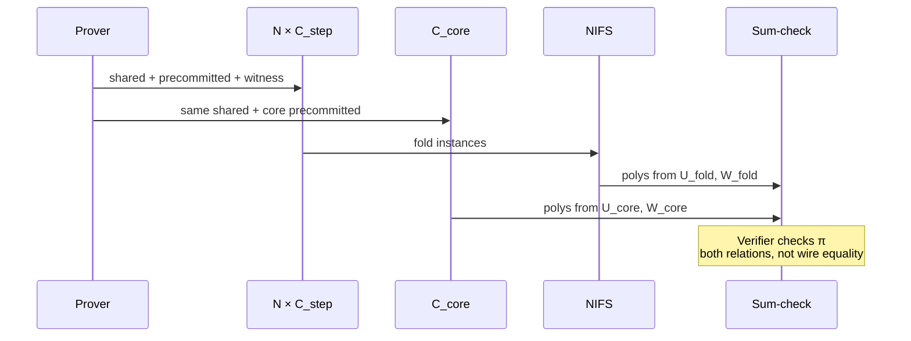

# SPHINCS+ Spartan2 — ZK verify plan & open problems

> **Repo:** [github.com/miha-stopar/sphincs-circuit](https://github.com/miha-stopar/sphincs-circuit) · branch [`master`](https://github.com/miha-stopar/sphincs-circuit/tree/master) · commit [`a89d3ec`](https://github.com/miha-stopar/sphincs-circuit/commit/a89d3ec)  
> **This note:** [`docs/HACKMD_NEUTRONNOVA_PLAN.md`](https://github.com/miha-stopar/sphincs-circuit/blob/a89d3ec/docs/HACKMD_NEUTRONNOVA_PLAN.md)

---

## 1. Goal

Prove in zero-knowledge that a **SPHINCS+-SHA2-128s-simple** signature is valid for a message under a public key—without revealing the signature (ZK variant **A**: public `PK`, `M`, `mlen`; private `σ` and auxiliary hash trace).

| | Reference | Public inputs | Private witness |
| --- | --- | --- | --- |
| Native verify | PQClean `crypto_sign_verify` | `PK`, `M`, `σ` | — |
| This work (target) | Same relation in R1CS | `PK`, `M`, `mlen` | `σ`, every SHA-256 compression in verify, FORS/WOTS/HT aux |

**Track A proof stack (v1):** transparent SNARK **Spartan2 0.9.0** + **NeutronNova** folding over a uniform **step** circuit (one SHA-256 compression per instance) plus a separate **core** circuit (SPHINCS+ structure and digest linking). PCS: **Hyrax** (`T256HyraxEngine`). Folding and PCS are classical, not lattice-based; the **signature scheme** is post-quantum (SPHINCS+).

**Why folding:** one verify touches on the order of **~2k–3k** SHA-256 compressions. Replicating a full hash gadget per compression in a single R1CS is impractical; NeutronNova folds many satisfactions of the same `C_step` before a final Spartan proof that also includes `C_core`.

---

## 2. Architecture (current)



### Crate split

| Crate | Role |
| --- | --- |
| `sphincs-ref` | PQClean FFI, `verify_with_trace`, compression trace |
| `sphincs-circuit` | R1CS gadgets: `sha256_compress`, `thash`, FORS, WOTS, hypertree, `synthesize_verify_core` |
| `sphincs-prover` | `FoldStepCircuit`, `FoldCoreChainCircuit`, NeutronNova `setup` / `fold_and_prove` / `verify` |

Parameter set: **SPHINCS+-SHA2-128s-simple** (PQClean `sphincs-sha2-128s-simple`).

---

## 3. Mental model: step + core in one proof (not one circuit)

NeutronNova produces **one** zero-knowledge proof π. The verifier accepts π iff **two separate R1CS relations** hold:

1. **Folded step relation** — `N` instances of `C_step` (each: one compression), accumulated by NIFS into `(U_fold, W_fold)`.
2. **Core relation** — one instance of `C_core` (glue: local chain equalities today; full verify logic later).

**“Combined with folding”** means the **sum-check inside π is batched** over polynomials from **both** the folded step accumulator and the core instance. Spartan2 computes `Az, Bz, Cz` for the folded step witness and, in parallel, for the core witness, then runs outer/inner sum-checks on the **joint** claims.

**It does not mean** that digests allocated in `C_core` are automatically the same wires as compression outputs in `C_step`. Calling `fold_and_prove(steps, core)` only places both relations in the **same proof transcript**. **Cryptographic binding** between them is a **separate engineering step**:

| Mechanism | Split `C_step` + `C_core`? | Status |
| --- | --- | --- |
| **Shared witness** (`SpartanCircuit::shared`) | Yes (target) | Blocked on Spartan2 0.9.0 (`num_shared > 0` → verify fail) |
| **Fold IO / accumulator → core** | Yes (if API exists) | Not wired |
| **Glue inside one `C_step`** (packed chain) | No (core is placeholder) | **Works** (sound local chain only) |



**Soundness target (cross-circuit):**

```text
∀i:  H_out,i = Compress(H_in,i, block_i)           [folded C_step]
∀ link:  H_out,i = H_in,j  (same R1CS vars)       [C_core ↔ step]
… hash_message, FORS, WOTS+, hypertree, root …     [C_core]
```

**Today (split smoke path):** the first line uses **step wires**; chain equalities in `FoldCoreChainCircuit` use **separate allocated bytes** copied from the PQClean trace. A malicious prover could satisfy each side with inconsistent digests while still passing π.

---

## 4. Spartan2 prove pipeline

Two shapes: `S_step`, `S_core`, then `SplitR1CSShape::equalize` (same witness **segment sizes**, different constraint matrices).

| Phase | What runs |
| --- | --- |
| Setup | `r1cs_shape(step)`, `r1cs_shape(core)`, equalize, commitment key |
| prep_prove | `shared_witness(step[0])` → `comm_W_shared`; precommitted per step `i`; precommitted(core) on **same** `shared[]` handles |
| prove | `(U_i, W_i)` for all steps ∥ `(U_core, W_core)` |
| NIFS | fold **steps only** → `(U_fold, W_fold)` |
| Sum-check | batched over folded step + core polynomials → π |



Wrapper: `crates/sphincs-prover/src/fold.rs` → `spartan2::neutronnova_zk::NeutronNovaZkSNARK`.

**Demo — split circuits (no wire binding):**

```bash
cargo test -p sphincs-prover --features pqclean \
  --test fold_split_step_core -- --nocapture
```

---

## 5. What exists in the repo today

### M2 — Core gadgets (mostly done)

Bit-accurate SHA-256 compression step, `thash`, `compute_root`, WOTS+, FORS, hypertree layer, `hash_message`, top-level `synthesize_verify_core` (oracle-aligned tests; full core synthesis test is slow / `#[ignore]` in debug).

### M3 — Folding + prove (in progress)

| Piece | Status |
| --- | --- |
| NeutronNova pipeline on real PQClean trace rows | ✅ |
| `FoldCoreChainCircuit` + `fold_local_chain` | ✅ (byte links in core only) |
| `FoldPackedChainCircuit` / `FoldPackedCoreBoundCircuit` | ✅ sound **intra-step** chain |
| `FoldStepBoundCircuit` + shared witness | ⚠️ implemented; `fold_bound_shared` **ignored** (Spartan2 verify) |
| Full trace / KAT prove | ⬜ |
| `fold-bench` scaling | ✅ |

### Prover artifacts (quick map)

| Type | Path (in repo) |
| --- | --- |
| Step | `crates/sphincs-prover/src/fold.rs` — `FoldStepCircuit` |
| Core placeholder | `FoldCoreCircuit` (shape padding, Spartan bench parity) |
| Core chain glue | `crates/sphincs-prover/src/core.rs` — `FoldCoreChainCircuit` |
| Shared binding (experimental) | `crates/sphincs-prover/src/bound.rs` |
| Packed sound chain | `packed.rs`, `bound.rs` — `FoldPackedCoreBoundCircuit` |

### Tests

| Test | Meaning |
| --- | --- |
| `fold_split_step_core` | **Split** step + core, one π; explains combination without binding |
| `fold_local_chain` | Split + trace link bytes in core |
| `fold_packed_chain` | Wired chain, placeholder core |
| `fold_bound_packed_core` | Wired chain + boundary checks in step |
| `fold_bound_shared` | `#[ignore]` — shared witness |

```bash
# Split step + core demo
cargo test -p sphincs-prover --features pqclean \
  --test fold_split_step_core -- --nocapture

# Local chain fold (default 16 steps; override FOLD_CHAIN_STEPS=32)
cargo test -p sphincs-prover --features pqclean \
  --test fold_local_chain

# Bench (release)
cargo run -p sphincs-prover --features pqclean --release \
  --bin fold-bench -- 16
```

---

## 6. Roadmap phases

| Phase | Status | Deliverable |
| --- | --- | --- |
| **0** Infrastructure | ✅ | Trace → `FoldStepCircuit`, NeutronNova setup/prove/verify, `fold-bench` |
| **1** Sound compression topology | 🟡 | Shared binding (split) **or** scaled packed segments |
| **2** Real `C_core` | ⬜ | Port `synthesize_verify_core` into `SpartanCircuit`; bind to folded outputs (Phase 1) |
| **3** Full trace + KAT | ⬜ | ~2k–3k compressions, PQClean KAT ZK verify |
| **4** Hardening | ⬜ | Public IO, perf, optional length-hiding / robust params |

### Phase 1 detail (binding strategies)

| Approach | Split step/core? | Sound chain across instances? |
| --- | --- | --- |
| **A.** `FoldPackedChainCircuit` | Core placeholder | ✅ per packed segment |
| **B.** Shared link digests | ✅ | ✅ if Spartan2 shared works |
| **C.** `FoldCoreChainCircuit` + plain step | ✅ | ❌ duplicate witness bytes (smoke only) |

**Next:** unblock **B** (P1); scale **A** for long traces; keep **C** as API documentation only.

### Phase 2 detail

- Only **compressions** stay in folded `C_step`.
- **Indices, FORS, WOTS+, hypertree, root** live in `C_core`.
- Logical arrow “folded compressions → chain glue” must become **shared vars** or fold IO—not a second copy of digests in core.

---

## 7. Open problems

Grouped by impact on a production ZK verify proof.

---

### P1 — Shared witness + NeutronNova verify (**blocks split binding**)

**Symptom:** `num_shared > 0` → `InvalidSumcheckProof` or `rerandomize_commitment: commitment and blinds must have the same length`.

**Hypotheses:** `equalize` mismatch between `S_step` and `S_core` shared columns; u32/limb bit decomposition in `shared_link.rs`; upstream Spartan2 NeutronNova only tested with `shared() → []` (Microsoft `sha256_neutronnova` bench).

**Tasks**

- [ ] Minimal repro: 2 steps, one shared `AllocatedNum`, trivial core.
- [ ] Byte-identical `shared()` allocation order in step vs core circuits.
- [ ] Spartan2 upstream issue / version bump.

**Done when:** `fold_bound_shared` passes; inconsistent step vs core digests are impossible.

---

### P2 — What does batched sum-check actually couple?

**Question:** Besides `comm_W_shared`, is there any constraint tying `W_fold` to `W_core`?

**Tasks**

- [ ] Audit `NeutronNovaNIFS::prove` + relaxed Spartan verifier in Spartan2.
- [ ] Write explicit “coupling contract” for integrators.

---

### P3 — Fold IO / accumulator → core inputs

**Question:** Can `C_core` consume folded witness words as public IO or challenges?

**Tasks**

- [ ] Search Spartan2 for `folded_W` / `folded_U` APIs usable from `SpartanCircuit::synthesize`.

---

### P4 — `h_out` pinning on `FoldStepCircuit`

Explicit `h_out = Compress(...)` broke verify (same family as P1). Clarify when output pinning is safe with empty shared.

---

### P5 — Instance count, padding, full trace

NeutronNova batch size → power of two; padding duplicates can break bound chains. Plan batching for ~2244 compressions.

---

### P6 — Core circuit size vs Spartan limits

Full `synthesize_verify_core` may exceed per-circuit limits; may need `MultiRoundCircuit` or sliced core.

---

### P7 — Cross-relation soundness statement

Document precisely what π proves **today** (two relations, one proof) vs **target** (bound digests + full verify).

---

## 8. Soundness checklist (integrator view)

| Claim | In π today? | Notes |
| --- | --- | --- |
| Each step row: `Compress(h_in, block)` | ✅ folded `C_step` | `h_out` not pinned to witness (Spartan2 0.9.0) |
| Local chain: `h_out[i] = h_in[i+1]` | ⚠️ | Core bytes only; not step wires |
| `hm`, FORS, WOTS+, HT, root | ⬜ | Gadgets exist; not in prover `C_core` yet |
| Step outputs = core link vars | ❌ | Needs P1 / P3 / packed workaround |
| σ hidden (ZK A) | ✅ | Spartan ZK mode; σ in witness |

---

## 9. Decision log (v1)

| Topic | Choice |
| --- | --- |
| Statement | PQClean `crypto_sign_verify` for 128s-simple |
| Step circuit | One SHA-256 compression per instance |
| Proof system | Spartan2 + NeutronNova + Hyrax |
| ZK | Variant A — `σ` private |
| Message | Padded 4096 B, public `mlen` |
| Hash in circuit | SHA-256 (not Poseidon) |

---

## 10. References

| Resource | URL |
| --- | --- |
| **This repository** | https://github.com/miha-stopar/sphincs-circuit |
| Spartan2 NeutronNova SHA-256 bench | https://github.com/Microsoft/Spartan2/blob/main/benches/sha256_neutronnova.rs |
| SPHINCS+ spec | https://sphincs.org/ |
| PQClean | https://github.com/PQClean/PQClean |

---

*Last updated: 2026-05-29 — commit [`a89d3ec`](https://github.com/miha-stopar/sphincs-circuit/commit/a89d3ec) on [`master`](https://github.com/miha-stopar/sphincs-circuit/tree/master).*
