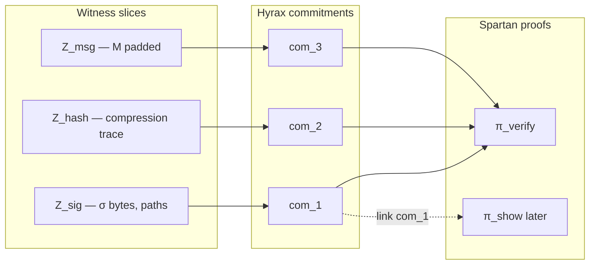

# Proof system: Spartan2, folding, and SplitSpartan

## Components (v1)

| Piece | Role in this repo |
|-------|-------------------|
| **bellpepper `sha256`** | R1CS for one compression ([gadgets::sha256](https://docs.rs/bellpepper/latest/bellpepper/gadgets/sha256/index.html)) |
| **NeutronNova** | Fold `N` step-circuit instances → one ([Spartan2 bench](https://github.com/microsoft/Spartan2/blob/main/benches/sha256_neutronnova.rs)) |
| **Spartan2** | Prove folded step + core |
| **Hyrax / PCS** | Polynomial commitments inside Spartan |

See [FOLDING.md](FOLDING.md) for step vs core (arithmetization split).

---

## What “SplitSpartan” means (commitment split)

**SplitSpartan** is **not** the same as splitting SHA into step + core.

It means **split-committed R1CS witnesses** (Vega §2.1.1, OpenAC §3.1):

- Witness vector `Z` is partitioned into **slices** `Z = (Z_pre, Z_online, …)`.
- Each slice gets its own **Hyrax commitment** `com(Z_pre)`, `com(Z_online)`.
- Multiple circuits can **share** a slice (equality of commitments).
- Prover can **rerandomize** commitments for unlinkability across sessions.

---

## Do we need SplitSpartan for signature-only v1?

**No — not required for a single monolithic proof.**

| Approach | Sig-verify v1 | Credential system later |
|----------|---------------|-------------------------|
| **One witness, one Spartan proof** | **Enough** — public `(PK, M)`, private `(σ, trace)` | Reuse as inner relation |
| **SplitSpartan (multiple commitments + linked proofs)** | Optional complexity | **Useful** — heavy offline verify vs light online show |

**Recommendation:**

1. **v1:** One R1CS, one `SpartanZkSNARK::prove`, one PCS commitment tree over the full witness (or Spartan’s default committed witness). Simpler debugging.
2. **When adding credentials:** Introduce witness slices, e.g.  
   - `Z_verify` — σ + hash trace (heavy, amortized),  
   - `Z_show` — predicates + session nonce (light),  
   with `com(Z_verify)` equality linked across proofs (OpenAC prepare/show).

Design witness layout now so **σ and trace are separable columns** in R1CS — makes a future commit split mechanical without rewriting gadgets.

---

## SplitSpartan vs NeutronNova vs “split core/step”

| Name | What it splits |
|------|----------------|
| **Step + core** | **Circuit topology** — repeated compression vs SPHINCS+ glue |
| **NeutronNova** | **Many step instances** → one folded instance |
| **SplitSpartan** | **Witness commitments** — slices, rerandomize, cross-circuit link |

All three can be combined later; v1 needs **step + core + NeutronNova**; **SplitSpartan** is optional until multi-phase credentials.

---

## ZK

Spartan2 ZK via Nova folding on **verifier checks** ([`spartan_zk`](https://docs.rs/spartan2/latest/spartan2/spartan_zk/index.html)), not by revealing the full witness.

Variant A ([DECISIONS.md](DECISIONS.md)): `σ` and trace stay in witness; only `(PK, M, mlen)` public.

---

## References

- [Spartan2 README](https://github.com/microsoft/Spartan2)
- Vega (2025/2094) §2.1.1 split-committed R1CS
- OpenAC (2026/251) §3.1 prepare/show linking via Pedersen/Hyrax column
