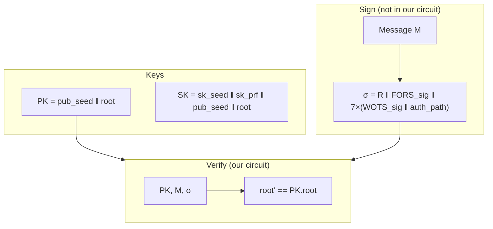
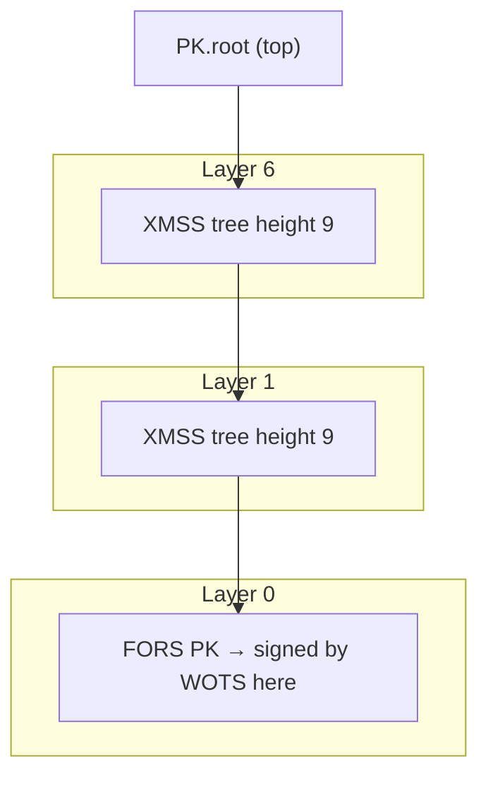
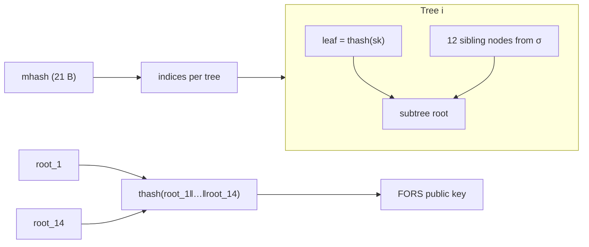
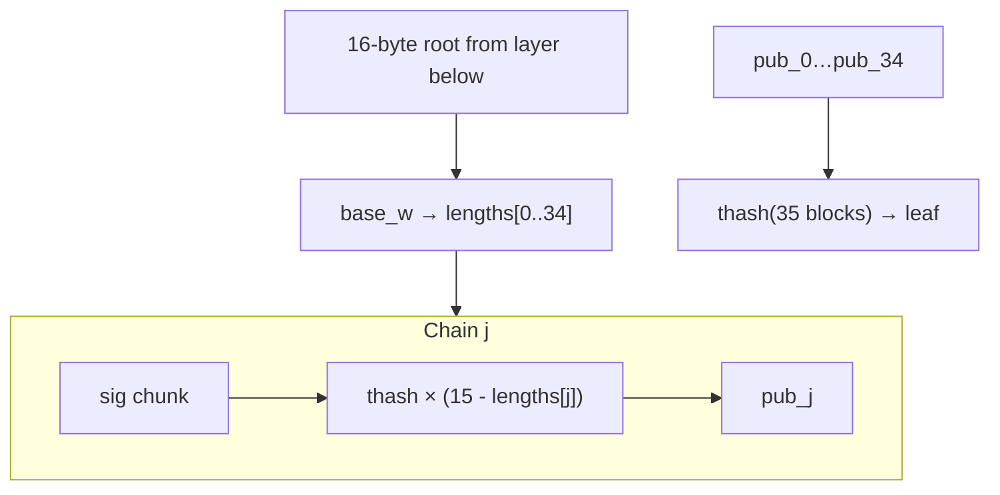
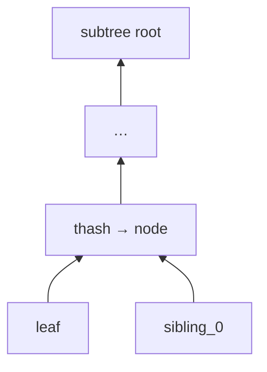
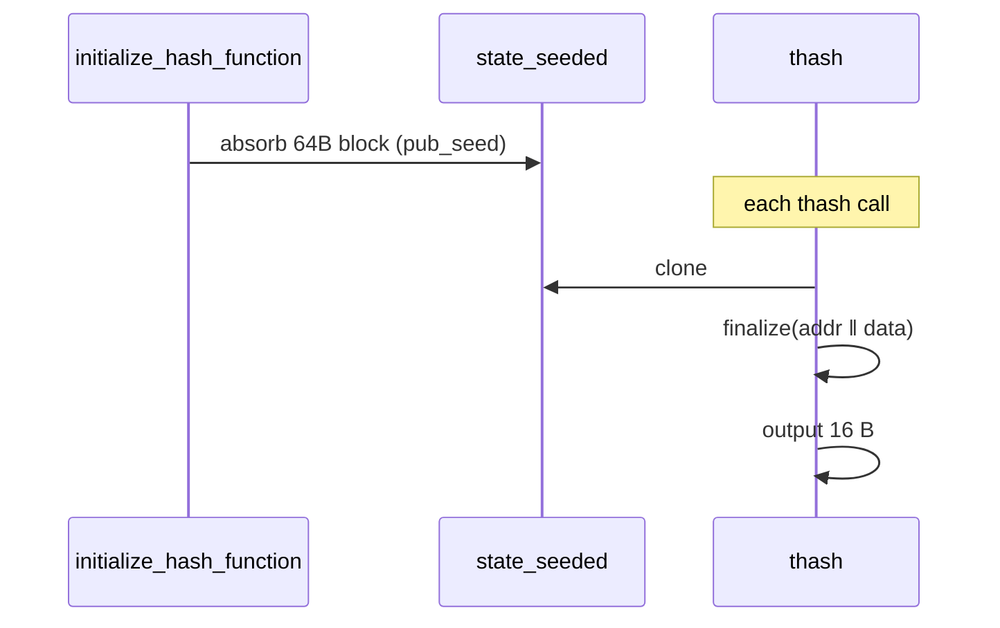
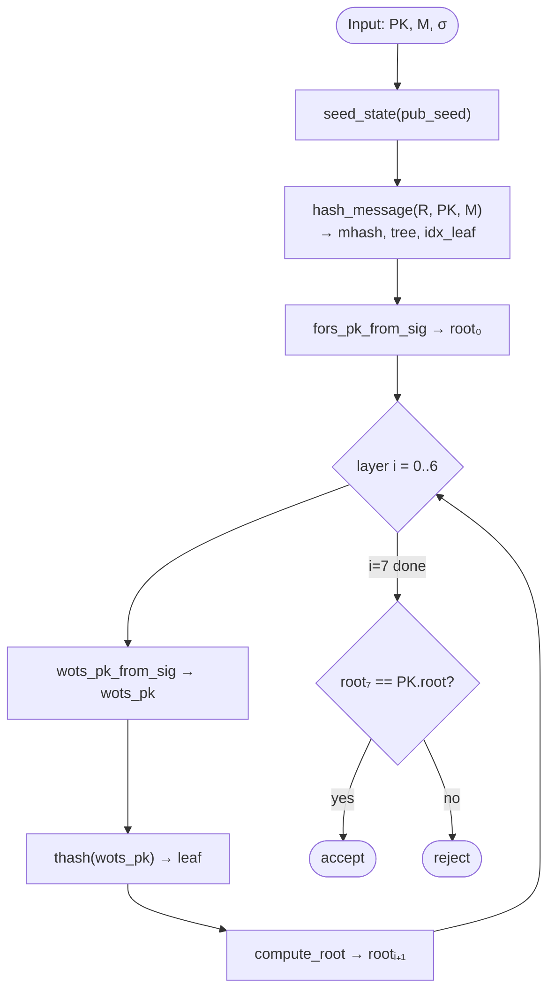
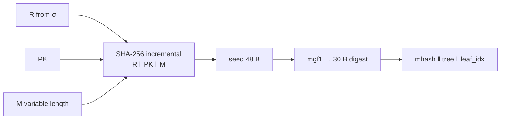

# SPHINCS+ structure and verification flow

Parameter set for this repo: **SHA2-128s simple** (PQClean `sphincs-sha2-128s-simple`).

Constants: `N=16` byte hash output, `d=7` hypertree layers, tree height `h=9` per layer, `k=14` FORS trees, FORS height `a=12`, WOTS+ length `35` chains.

---

## 1. Key idea

SPHINCS+ is a **stateless hash-based** signature:

- No secret state updates (unlike XMSS).
- Security from hash function one-wayness + tree structure.
- Large signatures, fast verify dominated by **many SHA-256 calls**.



---

## 2. Signature layout (128s)

```text
σ (7856 bytes)
├── R                    16 B   randomness (prefix of sig)
├── FORS signature       (12+1)×14×16 = 2184 B  (approx: k×(a+1)×n)
└── Hypertree × d=7
    each layer:
    ├── WOTS+ signature  35×16 = 560 B
    └── auth path        h×16 = 9×16 = 144 B
```

Exact layout: `SPX_BYTES` in `params.h` / `sign.c`.

---

## 3. Hypertree (XMSS stack)

A **hypertree** stacks `d` layers of Merkle trees. Each leaf is a WOTS+ public key; each WOTS+ key signs the root of the layer below.



**Indices** `(tree, leaf_idx)` are derived from `hash_message(R, PK, M)` — 54 bits of tree position + 9 bits of leaf per layer (for 128s).

---

## 4. FORS (few-time signature, bottom layer)

**FORS** = Forest of Random Subsets: `k=14` trees of height `a=12`. Message digest selects one leaf per tree; signature reveals secret values + siblings to reconstruct per-tree roots, then hashes roots together.



Verify (`fors_pk_from_sig`): for each tree, recover leaf from sig, `compute_root` up height 12, aggregate with `thash(14 blocks)`.

---

## 5. WOTS+ (one Merkle leaf)

Winternitz OTS with `w=16`: message split into `35` base-16 digits. Each chain applies `thash` up to 15 times from signature chunk to public chain end.



---

## 6. Merkle authentication (`compute_root`)

Given leaf and auth path siblings, walk up height `h=9`, each step `thash(left‖right)` with address-dependent ordering.



Used in FORS (height 12) and each hypertree layer (height 9).

---

## 7. `thash` — the universal hash inside SPHINCS+

Almost every hash is `thash`:

```c
// thash_sha2_simple.c
clone(state_seeded);           // state already absorbed pub_seed
finalize(buf = addr[22] ‖ in[inblocks×16]);
truncate to 16 bytes out
```

`state_seeded` = one SHA-256 compression of padded `pub_seed` at init.



Our **step circuit** implements only the compressions inside `finalize` (and init), not the high-level `thash` API — core wires them.

---

## 8. Full verify algorithm (PQClean)

Matches `crypto_sign_verify` in `sign.c`:



### 8.1 `hash_message` detail



This is the **only** step whose compression count grows with `|M|`.

---

## 9. Mapping to ZK circuits

| Native | Circuit |
|--------|---------|
| `initialize_hash_function` | First compression(s) in trace |
| `hash_message` | Core control + compressed steps |
| `thash` | Sequence of compressions + core `H` links |
| `compute_root` | `h-1` × `thash(2)` + final `thash(2)` per call |
| `memcmp(root, pk.root)` | 128-bit (or byte) equality constraints |

See [FOLDING.md](FOLDING.md) for folding across all compressions.
