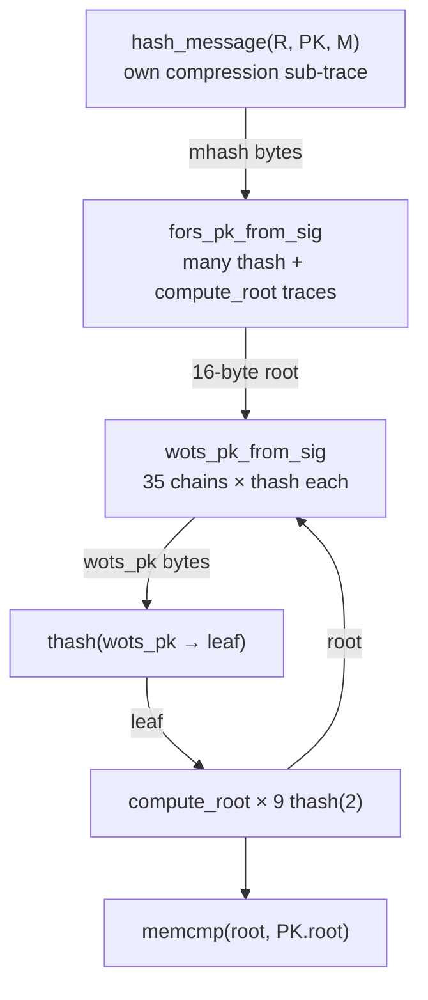

# SHA-256 compression trace and chaining

How `Sha256Compression` records map to PQClean verify, and what the **core** circuit must connect.

Types live in [`crates/sphincs-ref/src/lib.rs`](../crates/sphincs-ref/src/lib.rs).

---

## 1. What one trace entry is

```rust
pub struct Sha256Compression {
    pub index: usize,      // global 0 .. N-1 over entire verify
    pub h_in: [u8; 32],    // SHA internal state before this block
    pub block: [u8; 64],   // one 64-byte message block
    pub h_out: [u8; 32],   // state after compressing block
}
```

This matches one iteration of `while (inlen >= 64)` in [`crypto_hashblocks_sha256`](../third_party/PQClean/common/sha2.c) (line 163).

**Step circuit `C_step`:** for each entry `i`, prove `h_out == Compress(h_in, block)`.

**Folding:** all entries use the **same** `C_step`; NeutronNova folds instances `0..N-1`.

---

## 2. Two different meanings of “chain”

Do **not** confuse these:

### A) Compression chain (within one SHA-256 computation)

Inside a **single** `sha256_inc_finalize`, `sha256`, or `mgf1` call, compressions are **sequential**:

```text
H_out[i] = Compress(H_in[i], block[i])
H_in[i+1] = H_out[i]        ← core constraint
```

Example — one [`thash`](../third_party/PQClean/crypto_sign/sphincs-sha2-128s-simple/clean/thash_sha2_simple.c) call:

1. [`sha256_inc_ctx_clone`](../third_party/PQClean/common/sha2.c) copies [`ctx->state_seeded`](../third_party/PQClean/crypto_sign/sphincs-sha2-128s-simple/clean/context_sha2.c) (already absorbed `pub_seed` in [`seed_state`](../third_party/PQClean/crypto_sign/sphincs-sha2-128s-simple/clean/context_sha2.c)).
2. [`sha256_inc_finalize`](../third_party/PQClean/common/sha2.c) (line 627) runs `crypto_hashblocks_sha256` on `buf = addr[22] ‖ data`, then padding blocks.

Trace entries for **this thash only** form a contiguous index range; core enforces `H_out[k] == H_in[k+1]` for that range.

Final `outbuf` (32 B) is **not** equal to the last `h_out` state word-for-word in the API — PQClean truncates to `SPX_N` (16 B) in [`thash_sha2_simple.c` line 31](../third_party/PQClean/crypto_sign/sphincs-sha2-128s-simple/clean/thash_sha2_simple.c). Core must also constrain that truncation.

### B) Logical SPHINCS+ pipeline (between algorithms)

[`crypto_sign_verify`](../third_party/PQClean/crypto_sign/sphincs-sha2-128s-simple/clean/sign.c) runs **many separate** SHA computations. They do **not** share one global `H_in → H_out` chain.



**Core links 16-byte values**, not hash states:

| From | To | Code |
|------|-----|------|
| `σ[0..16]` = R | `hash_message` input | [`sign.c:193`](../third_party/PQClean/crypto_sign/sphincs-sha2-128s-simple/clean/sign.c), [`hash_sha2.c:181`](../third_party/PQClean/crypto_sign/sphincs-sha2-128s-simple/clean/hash_sha2.c) |
| `mhash` | FORS index + leaf recovery | [`fors.c:136`](../third_party/PQClean/crypto_sign/sphincs-sha2-128s-simple/clean/fors.c) `message_to_indices` |
| FORS `pk` (16 B) | WOTS message `msg` | [`sign.c:216`](../third_party/PQClean/crypto_sign/sphincs-sha2-128s-simple/clean/sign.c) `wots_pk_from_sig(..., root, ...)` |
| WOTS `wots_pk` | `thash` input `in` | [`sign.c:220`](../third_party/PQClean/crypto_sign/sphincs-sha2-128s-simple/clean/sign.c) |
| `leaf` | `compute_root` | [`sign.c:223-224`](../third_party/PQClean/crypto_sign/sphincs-sha2-128s-simple/clean/sign.c) |
| subtree `root` | next layer WOTS `msg` | loop `i = 0..SPX_D-1` |

So: **step** proves every compression; **core** proves (1) per-hash compression linking, (2) truncation to 16 B where applicable, (3) SPHINCS+ dataflow above, (4) signature bytes in σ are consistent with opens.

---

## 3. Example: one WOTS+ chain (compression + logical)

[`gen_chain`](../third_party/PQClean/crypto_sign/sphincs-sha2-128s-simple/clean/wots.c) (lines 23-35): for chain `j`, start from `sig[j*16 ..]`, apply `thash` repeatedly.

Each `thash(out, out, 1, ...)` is a **fresh** SHA with cloned `state_seeded` → its **own** compression sub-trace.

**Logical:** `out` after step `t` is input to step `t+1` (same 16-byte register, [`memcpy` implicit in `thash` in-place](../third_party/PQClean/crypto_sign/sphincs-sha2-128s-simple/clean/wots.c)).

**Core:**

- Tag trace ranges with `(call_id = "wots_layer_i_chain_j", step_t)`.
- Last `thash` output (truncated) equals `pk[j*16 .. (j+1)*16]` from [`wots_pk_from_sig`](../third_party/PQClean/crypto_sign/sphincs-sha2-128s-simple/clean/wots.c).

---

## 4. Example: `compute_root` (Merkle)

[`compute_root`](../third_party/PQClean/crypto_sign/sphincs-sha2-128s-simple/clean/utils.c) (lines 49-91): each level calls `thash` on `buffer` (32 B left ‖ 32 B right).

- Each `thash(..., 2, ...)` → separate compression sub-trace (54-byte `buf` in finalize).
- **Logical:** `buffer` after level `i` becomes input to level `i+1` with next sibling from `auth_path` in σ.

Core reads sibling bytes from private witness `σ` at offsets defined by `idx_leaf` and `tree_height`.

---

## 5. Instrumentation (M0) — the data object

**Goal:** After one `crypto_sign_verify`, produce:

```rust
pub struct Sha256Trace {
    pub compressions: Vec<Sha256Compression>,  // length N, exact
}
```

**Not** an estimate from parameter formulas — an **execution log** of PQClean.

### Hook (planned)

When built with `-DSPX_SHA256_TRACE` ([`build.rs`](../crates/sphincs-ref/build.rs)), each compression in [`crypto_hashblocks_sha256`](../third_party/PQClean/common/sha2.c) will record:


```c
// pseudocode
for each 64-byte block:
    record(h_in = statebytes[0..32], block, h_out = state after compress)
```

Also record compressions from:

- [`sha256_inc_blocks`](../third_party/PQClean/common/sha2.c) (line 601) — used in [`seed_state`](../third_party/PQClean/crypto_sign/sphincs-sha2-128s-simple/clean/context_sha2.c)
- Padding blocks inside [`sha256_inc_finalize`](../third_party/PQClean/common/sha2.c) (lines 641-666)
- One-shot [`sha256`](../third_party/PQClean/common/sha2.c) in [`mgf1_256`](../third_party/PQClean/crypto_sign/sphincs-sha2-128s-simple/clean/hash_sha2.c)

### Metadata (core needs this too)

Extend trace with tags (planned):

```rust
struct CompressionRecord {
    compression: Sha256Compression,
    call: TraceCall,  // HashMessage | Thash { layer, addr_type } | Mgf1 | ...
    pos_in_call: usize,
}
```

### Why exact list matters

If you guess “~2000 compressions” but the real trace has 2147 with specific `H_in[i+1] == H_out[i]` only **within** sub-ranges, the proof is wrong. The circuit must be **bit-for-bit** aligned with [`common/sha2.c`](../third_party/PQClean/common/sha2.c), not a reimplementation.

---

## 6. Related

- [FOLDING.md](FOLDING.md) — NeutronNova fold over trace length `N`
- [CODEMAP.md](CODEMAP.md) — file ↔ function map
- [PROOF_SYSTEM.md](PROOF_SYSTEM.md) — SplitSpartan vs single proof
